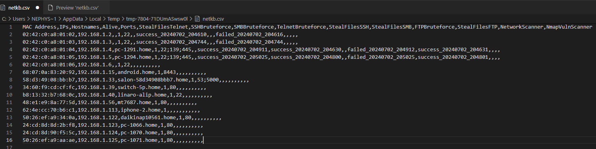
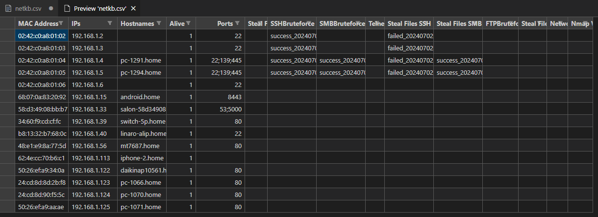
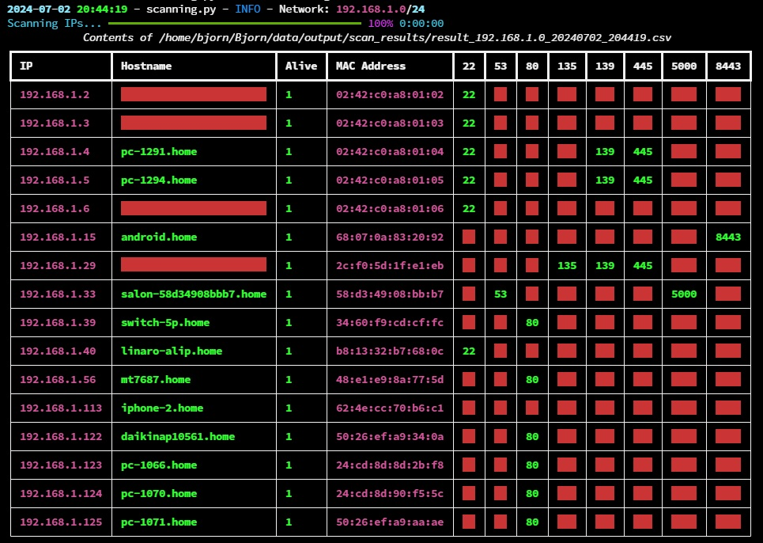

# 🖲️ Разработка Bjorn

<p align="center">
  
</p>

## 📚 Содержание

- [Дизайн](#-дизайн)
- [Образовательные аспекты](#-образовательные-аспекты)
- [Дисклеймер](#-дисклеймер)
- [Расширяемость](#-расширяемость)
- [Статус разработки](#-статус-разработки)
  - [Структура проекта](#-структура-проекта)
  - [Основные файлы](#-основные-файлы)
  - [Действия (Actions)](#-действия-actions)
  - [Структура данных](#-структура-данных)
- [Подробное описание проекта](#-подробное-описание-проекта)
  - [Поведение Bjorn](#-поведение-bjorn)
- [Запуск Bjorn](#-запуск-bjorn)
  - [Ручной запуск](#-ручной-запуск)
  - [Управление сервисом](#-управление-сервисом)
  - [Чистый старт](#-чистый-старт)
- [Важные файлы конфигурации](#-важные-файлы-конфигурации)
  - [Общая конфигурация (shared_config.json)](#-общая-конфигурация-shared_configjson)
  - [Конфигурация действий (actions.json)](#-конфигурация-действий-actionsjson)
- [Поддержка e-Paper дисплея](#-поддержка-e-paper-дисплея)
  - [Устранение призрачных изображений](#-устранение-призрачных-изображений)
- [Руководство по разработке](#-руководство-по-разработке)
  - [Добавление новых действий](#-добавление-новых-действий)
  - [Тестирование](#-тестирование)
- [Веб-интерфейс](#-веб-интерфейс)
- [Дорожная карта проекта](#-дорожная-карта-проекта)
  - [Текущий фокус](#-текущий-фокус)
  - [Планы на будущее](#-планы-на-будущее)
- [Лицензия](#-лицензия)

## 🎨 Дизайн

- **Портативность**: Автономное и портативное устройство, идеальное для пентестинга.
- **Модульность**: Расширяемая архитектура, позволяющая легко добавлять новые действия.
- **Визуальный интерфейс**: e-Paper HAT обеспечивает визуальный интерфейс для мониторинга текущих действий, отображения результатов или статистики и взаимодействия с Bjorn.

## 📔 Образовательные аспекты

- **Инструмент обучения**: Разработан как образовательный инструмент для изучения концепций кибербезопасности и методов пентестинга.
- **Практический опыт**: Предоставляет практические средства для студентов и профессионалов для ознакомления с практиками сетевой безопасности и инструментами оценки уязвимостей.

## ✒️ Дисклеймер

- **Этичное использование**: Этот проект предназначен исключительно для образовательных целей.
- **Ответственность**: Автор и участники проекта не несут ответственности за неправомерное использование Bjorn.
- **Правовое соответствие**: Несанкционированное использование этого инструмента для вредоносной деятельности запрещено и может повлечь уголовную ответственность.

## 🧩 Расширяемость

- **Эволюция**: Главная цель Bjorn — приобретать новые действия и расширять свой арсенал с течением времени.
- **Модульность**: Действия спроектированы как модули, которые можно легко расширять или модифицировать для добавления новой функциональности.
- **Возможности**: От захвата pcap-файлов до взлома хешей, атак человек-посередине и многого другого — возможности безграничны.
- **Участие**: Каждый пользователь может разрабатывать новые действия и добавлять их в проект.

## 🔦 Статус разработки

- **Статус проекта**: Активная разработка.
- **Текущая версия**: v1.4.0 (см. `version.txt`).
- **Причина**: Проект находится на ранней стадии и требует дальнейшей разработки и отладки.

### 🗂️ Структура проекта

```
Bjorn/
├── Bjorn.py
├── comment.py
├── display.py
├── epd_helper.py
├── init_shared.py
├── kill_port_8000.sh
├── logger.py
├── orchestrator.py
├── requirements.txt
├── shared.py
├── utils.py
├── webapp.py
├── __init__.py
├── actions/
│   ├── ftp_connector.py
│   ├── ssh_connector.py
│   ├── smb_connector.py
│   ├── rdp_connector.py
│   ├── telnet_connector.py
│   ├── sql_connector.py
│   ├── steal_files_ftp.py
│   ├── steal_files_ssh.py
│   ├── steal_files_smb.py
│   ├── steal_files_rdp.py
│   ├── steal_files_telnet.py
│   ├── steal_data_sql.py
│   ├── nmap_vuln_scanner.py
│   ├── scanning.py
│   └── __init__.py
├── backup/
│   ├── backups/
│   └── uploads/
├── config/
├── data/
│   ├── input/
│   │   └── dictionary/
│   ├── logs/
│   └── output/
│       ├── crackedpwd/
│       ├── data_stolen/
│       ├── scan_results/
│       ├── vulnerabilities/
│       └── zombies/
└── resources/
    └── waveshare_epd/
```

### ⚓ Основные файлы

#### Bjorn.py

Главная точка входа в приложение. Инициализирует и запускает основные компоненты, включая сетевой сканер, оркестратор, дисплей и веб-сервер.

#### comment.py

Отвечает за генерацию всех комментариев Bjorn, отображаемых на e-Paper HAT, на основе различных тем/действий и статусов.

#### display.py

Управляет дисплеем e-Paper HAT, обновляя экран с изображением персонажа Bjorn, диалогами/комментариями и текущей информацией, такой как статус сети, уязвимости и различная статистика.

#### epd_helper.py

Обрабатывает низкоуровневое взаимодействие с аппаратным обеспечением e-Paper дисплея.

#### logger.py

Определяет пользовательский логгер со специфическим форматированием и обработчиками для вывода в консоль и файл. Также включает пользовательский уровень логирования для сообщений об успехе.

#### orchestrator.py

ИИ Bjorn — эвристический движок, который оркестрирует различные действия, такие как сканирование сети, сканирование уязвимостей, атаки и кража файлов. Загружает и выполняет действия на основе конфигурации и устанавливает статус действий и Bjorn.

#### shared.py

Определяет класс `SharedData`, который содержит настройки конфигурации, пути и методы для обновления и управления общими данными между различными модулями.

#### init_shared.py

Инициализирует общие данные, используемые между различными модулями. Загружает конфигурацию и настраивает необходимые пути и переменные.

#### utils.py

Содержит вспомогательные функции, используемые в проекте.

#### webapp.py

Настраивает и запускает веб-сервер для предоставления веб-интерфейса для изменения настроек, мониторинга и взаимодействия с Bjorn.

### ▶️ Действия (Actions)

#### actions/scanning.py

Выполняет сканирование сети для выявления активных хостов и открытых портов. Обновляет базу знаний сети (`netkb`) и генерирует результаты сканирования.

#### actions/nmap_vuln_scanner.py

Выполняет сканирование уязвимостей с использованием Nmap. Разбирает результаты и обновляет сводку уязвимостей для каждого хоста.

#### Коннекторы протоколов

- **ftp_connector.py**: Брутфорс-атаки на FTP-сервисы.
- **ssh_connector.py**: Брутфорс-атаки на SSH-сервисы.
- **smb_connector.py**: Брутфорс-атаки на SMB-сервисы.
- **rdp_connector.py**: Брутфорс-атаки на RDP-сервисы.
- **telnet_connector.py**: Брутфорс-атаки на Telnet-сервисы.
- **sql_connector.py**: Брутфорс-атаки на SQL-сервисы.

#### Модули кражи файлов

- **steal_files_ftp.py**: Крадёт файлы с FTP-серверов.
- **steal_files_smb.py**: Крадёт файлы с SMB-шар.
- **steal_files_ssh.py**: Крадёт файлы с SSH-серверов.
- **steal_files_telnet.py**: Крадёт файлы с Telnet-серверов.
- **steal_data_sql.py**: Извлекает данные из SQL-баз данных.

### 📇 Структура данных

#### База знаний сети (netkb.csv)

Расположена в `data/netkb.csv`. Хранит информацию о:

- Известных хостах и их статусе (активен или offline).
- Открытых портах и уязвимостях.
- Истории выполнения действий (успех или неудача).

**Пример предварительного просмотра:**




#### Результаты сканирования

Расположены в `data/output/scan_results/`.
Этот файл генерируется при каждом сканировании сети. Используется для консолидации данных и обновления netkb.

**Пример:**



#### Живой статус (livestatus.csv)

Содержит информацию в реальном времени, отображаемую на e-Paper HAT:

- Общее количество известных хостов.
- Текущие активные хосты.
- Количество открытых портов.
- Другая статистика времени выполнения.

## 📖 Подробное описание проекта

### 👀 Поведение Bjorn

После запуска Bjorn выполняет следующие шаги:

1. **Инициализация**: Загружает конфигурацию, инициализирует общие данные и настраивает необходимые компоненты, такие как e-Paper HAT дисплей.
2. **Сканирование сети**: Сканирует сеть для выявления активных хостов и открытых портов. Обновляет базу знаний сети (`netkb`) результатами.
3. **Оркестрация**: Управляет различными действиями на основе конфигурации и базы знаний сети. Включает сканирование уязвимостей, атаки и кражу файлов.
4. **Сканирование уязвимостей**: Выполняет сканирование уязвимостей на обнаруженных хостах и обновляет сводку уязвимостей.
5. **Брутфорс-атаки и кража файлов**: Запускает брутфорс-атаки и крадёт файлы на основе критериев конфигурации.
6. **Обновление дисплея**: Непрерывно обновляет e-Paper HAT дисплей текущей информацией: статус сети, уязвимости, различная статистика. Bjorn также отображает случайные комментарии на основе различных тем и статусов.
7. **Веб-сервер**: Предоставляет веб-интерфейс для мониторинга и взаимодействия с Bjorn.

## ▶️ Запуск Bjorn

### 📗 Ручной запуск

Для ручного запуска Bjorn (без сервиса, убедитесь что сервис остановлен: `sudo systemctl stop bjorn.service`):

```bash
cd /home/bjorn/Bjorn

# Запуск Bjorn
sudo python Bjorn.py
```

### 🕹️ Управление сервисом

Управление сервисом Bjorn:

```bash
# Запуск Bjorn
sudo systemctl start bjorn.service

# Остановка Bjorn
sudo systemctl stop bjorn.service

# Проверка статуса
sudo systemctl status bjorn.service

# Просмотр логов
sudo journalctl -u bjorn.service
```

### 🪄 Чистый старт

Для сброса Bjorn в начальное состояние:

```bash
sudo rm -rf /home/bjorn/Bjorn/config/*.json \
    /home/bjorn/Bjorn/data/*.csv \
    /home/bjorn/Bjorn/data/*.log \
    /home/bjorn/Bjorn/data/output/data_stolen/* \
    /home/bjorn/Bjorn/data/output/crackedpwd/* \
    /home/bjorn/Bjorn/config/* \
    /home/bjorn/Bjorn/data/output/scan_results/* \
    /home/bjorn/Bjorn/__pycache__ \
    /home/bjorn/Bjorn/config/__pycache__ \
    /home/bjorn/Bjorn/data/__pycache__ \
    /home/bjorn/Bjorn/actions/__pycache__ \
    /home/bjorn/Bjorn/resources/__pycache__ \
    /home/bjorn/Bjorn/web/__pycache__ \
    /home/bjorn/Bjorn/*.log \
    /home/bjorn/Bjorn/resources/waveshare_epd/__pycache__ \
    /home/bjorn/Bjorn/data/logs/* \
    /home/bjorn/Bjorn/data/output/vulnerabilities/* \
    /home/bjorn/Bjorn/data/logs/*

```

Всё будет автоматически пересоздано при следующем запуске Bjorn.

## ❇️ Важные файлы конфигурации

### 🔗 Общая конфигурация (`shared_config.json`)

Определяет различные настройки Bjorn, включая:

- Булевы настройки (`manual_mode`, `websrv`, `debug_mode` и т.д.).
- Временные интервалы и задержки.
- Сетевые настройки.
- Списки портов и чёрные списки.
Эти настройки доступны на веб-странице (требуется вход: `admin` / `bjorn` по умолчанию, см. [SECURITY.md](SECURITY.md)).

### 🛠️ Конфигурация действий (`actions.json`)

Список действий, выполняемых Bjorn, включая (генерируется динамически из содержимого папки):

- Определения модулей и классов.
- Назначения портов.
- Родительско-дочерние отношения.
- Определения статусов действий.

## 📟 Поддержка e-Paper дисплея

На данный момент жёстко настроено для e-Paper HAT 2.13 дюйма V2 и V4.
Программа автоматически определяет модель экрана и адаптирует выражения Python в коде.

Для других версий:
- Поскольку у автора нет v1 и v3 для проверки алгоритма, остаётся надеяться, что они будут работать корректно.

### 🍾 Устранение призрачных изображений!
В процессе работы над совместимостью Bjorn с различными версиями экранов автор экспериментировал с параметрами и обнаружил, что можно устранить призрачные изображения (ghosting) на экранах! Этот метод может быть полезен для всех остальных проектов с e-Paper дисплеями.

## ✍️ Руководство по разработке

### ➕ Добавление новых действий

1. Создайте новый файл действия в `actions/`.
2. Реализуйте требуемые методы:
   - `__init__(self, shared_data)`
   - `execute(self, ip, port, row, status_key)`
3. Добавьте действие в `actions.json`.
4. Следуйте шаблонам существующих действий.

### 🧪 Тестирование

```bash
# Полный набор с coverage-gate (должно пройти)
pytest tests/ -v

# Быстрая итерация без подсчёта покрытия
pytest --no-cov

# Один файл
pytest tests/test_web_auth.py -v

# Линтинг (fail-under 8, max-line-length 100, .pylintrc)
pylint <файл_или_директория>
```

Текущее состояние (v1.4.0): **349 тестов**, покрытие ~34.4% (gate
`--cov-fail-under=30` в `pytest.ini`). Целевой ориентир — 50% (запланирован
на v1.4.0 через backfill тестов для `Bjorn.py`, `orchestrator.py`,
`display.py`, `comment.py`).

Важно различать два типа тестов:

- **поведенческие** — реально вызывают код / шлют HTTP-запросы / поднимают
  сервер и проверяют результат (пример: `tests/test_shell_injection.py`,
  `tests/test_web_static_files.py::TestStaticAssetResolution`);
- **source-level (AST)** — инспектируют исходник. Они ловят «использован ли
  нужный API», но **не гарантируют** корректное поведение рантайма.
  Source-level тесты должны сопровождаться поведенческим дублёром для
  user-facing функций. См. `tests/test_runtime_smoke.py` для AST-проверок
  threading lifecycle.

### 🖥️ Виртуальное тестирование (headless в ВМ)

**После каждого наката обновлений на SD-карту — ОБЯЗАТЕЛЬНО прогнать
virtual headless-тест в ВМ.** Это ловит регрессии веб-слоя/логики за
секунды, до медленного физического цикла (карта → RPi → тест → вынуть →
правка → redeploy). Реальный RPi + e-Paper HAT нужен только для проверки
**визуального рендера экрана** (~10% функционала); всё остальное
(веб-логин, сессии, config, instance lock, health monitor, CSRF,
security headers) тестируется headless в VirtualBox.

Headless-режим (`epd_type:"none"`, PORT-11) пропускает EPD-инициализацию,
и веб-интерфейс становится основным. Процедура (на хосте-ВМ, БЕЗ карты):

```bash
cd /home/kali/Projects/Bjorn

# 1. Временный headless-конфиг (loopback, без EPD). Файл трекается —
#    правим локально и revert'им в конце.
python3 -c "
import json
p='config/shared_config.json'
c=json.load(open(p))
c['epd_type']='none'
c['web_bind_address']='127.0.0.1'
json.dump(c,open(p,'w'),indent=4,ensure_ascii=False)
"

# 2. Убедиться, что runtime-deps установлены (если ВМ свежая):
pip install -r requirements.txt --break-system-packages

# 3. Запустить Bjorn headless в фоне.
nohup python3 Bjorn.py > /tmp/bjorn_headless.log 2>&1 &
sleep 5

# 4. Проверки (ожидаемый результат в комментарии):
curl -s -u admin:bjorn http://127.0.0.1:8000/version                 # {"version":"1.4.0"}
curl -s -o /dev/null -w '%{http_code} %{redirect_url}\n' http://127.0.0.1:8000/   # 302 .../login
curl -s -i -X POST http://127.0.0.1:8000/login \
   -H 'Content-Type: application/json' \
   -d '{"username":"admin","password":"bjorn"}' | grep -i set-cookie  # bjorn_session=...
grep -o 'health thread_count=[0-9]* rss_kb=[0-9]* fd_count=[0-9]*' /tmp/bjorn_headless.log | head -1

# 5. Остановить и восстановить конфиг.
pkill -f 'python3 Bjorn.py'
git checkout config/shared_config.json
```

Что проверяем (минимум): `version` → корректная; `/` без auth → 302 на
`/login`; `POST /login` → `Set-Cookie: bjorn_session`; `health`-строка в
логе. Опционально: открыть `http://127.0.0.1:8000` в браузере хоста (через
port-forward ВМ) и пройти логин руками.

**Не тестируется в ВМ** (нужен RPi + HAT): EPD-рендер (PORT-2/3/6 — пиксели
на реальном экране), SPI/GPIO, реальное сканирование сети.

### 📝 Конвенция коммитов

Сообщения коммитов и релизные артефакты — **на русском**. Тип Conventional
Commits (`fix`/`feat`/`docs`/`chore`/`refactor`/`test`) остаётся на
английском, scope и описание — на русском. См. [CONTRIBUTING.md §«Формат
коммитов»](CONTRIBUTING.md).

### 📚 Актуальность документации перед релизом

**Перед каждым тегом релиза вся документация должна быть актуализирована и
согласована с кодом.** Релиз не закрывается, пока не проверены:

- текущая версия (`version.txt`) во всех упоминаниях в телах доков;
- supported-versions table в [SECURITY.md](SECURITY.md);
- дата OS-образа и версия ядра в [README.md](README.md) / [INSTALL.md](INSTALL.md);
- команды и цифры тестов (количество, coverage-gate) в этом файле и
  [tests/COVERAGE.md](tests/COVERAGE.md);
- дефолтные креды/настройки (например, web-auth `admin:bjorn`);
- ссылки ведут на форк `Chumikov/Bjorn`, а не на upstream `infinition`.

Полный аудит-чеклист и последовательность релиза — в `AGENTS.md` (раздел
«Release checklist»). История аудита v1.3.4 — пример полного прогона.

### 🔧 Git executable bit

Любой скрипт, который запускается через `Exec*` в systemd unit или напрямую
через `./script.sh`, **должен** иметь executable bit зафиксированный в git
index. Иначе `git checkout` / `git pull` сбросит его в `100644`, и systemd
упадёт с `status=203/EXEC`.

```bash
# Установить bit один раз (git будет хранить его в index):
git update-index --chmod=+x kill_port_8000.sh
git update-index --chmod=+x wifi_fix.sh
git update-index --chmod=+x Bjorn.py

# Проверка: первая колонка должна быть 100755, не 100644
git ls-files -s kill_port_8000.sh Bjorn.py
```

В v1.3.2 этот шаг был пропущен — `install_bjorn.sh` выставлял `chmod +x`
при установке, но после `git pull` бит терялся, и сервис падал на старте.

### 🧵 Threading lifecycle

Bjorn — длительно живущий процесс с 3-4 рабочими потоками. Главное правило:

**Main thread обязан иметь wait point (join/event/loop).**

Если добавить новый поток, выбирай daemon/non-daemon осознанно:
- **non-daemon** — prevent exit процесса. Использовать для core workers
  (`display_thread`, `bjorn_thread`, `orchestrator_thread`, `web_thread`).
- **daemon** — умирает вместе с процессом. Только для cleanup helpers.

**Опасный паттерн** (вызывает crash-loop на реальном железе):
```python
# ❌ НЕ ДЕЛАЙ ТАК
bjorn_thread = threading.Thread(target=bjorn.run, daemon=True)
bjorn_thread.start()
# ... main thread выходит из __main__ → процесс завершается
# systemd Restart=always переподнимает сервис каждые ~8 секунд
```

**Правильный паттерн**:
```python
# ✅ Non-daemon + main wait
bjorn_thread = threading.Thread(target=bjorn.run)  # non-daemon
bjorn_thread.start()
# ...
bjorn_thread.join()  # main блокируется до выхода worker
```

CI-тесты (`pytest`) **не ловят** threading lifecycle баги — они проявляются
только при реальном запуске процесса. Source-level checks в
`tests/test_runtime_smoke.py` ловят самые частые регрессии (отсутствие
join, daemon на core потоке), но финальное тестирование на реальном RPi
обязательно для любого изменения в `Bjorn.py` / `webapp.py`.

## 💻 Веб-интерфейс

- **Доступ**: `http://[ip-устройства]:8000`
- **Аутентификация**: страница логина + HMAC-сессионные cookie (PORT-8, v1.4.0).
  Логин/пароль по умолчанию `admin` / `bjorn` (salted PBKDF2-hash в
  `config/shared_config.json`, ключи `web_password_hash`/`web_password_salt`).
  Basic Auth сохранён как fallback для curl/API. Смените пароль перед deploy
  в сеть. Подробности — [SECURITY.md](SECURITY.md).
- **Возможности**:
  - Мониторинг в реальном времени с консолью.
  - Управление конфигурацией.
  - Просмотр результатов (учётные данные и файлы).
  - Управление системой.

## 🧭 Дорожная карта проекта

### 🪛 Текущий фокус

- Повышение стабильности.
- Исправление ошибок.
- Надёжность сервиса.
- Обновление документации.

### 🧷 Планы на будущее

- Дополнительные модули атак.
- Улучшенная отчётность.
- Улучшенный пользовательский интерфейс.
- Расширенная поддержка протоколов.

---

## 📜 Лицензия

2024 infinition, 2026 Chumikov Sec — Bjorn распространяется под лицензией MIT. Подробности см. в файле [LICENSE](LICENSE).
